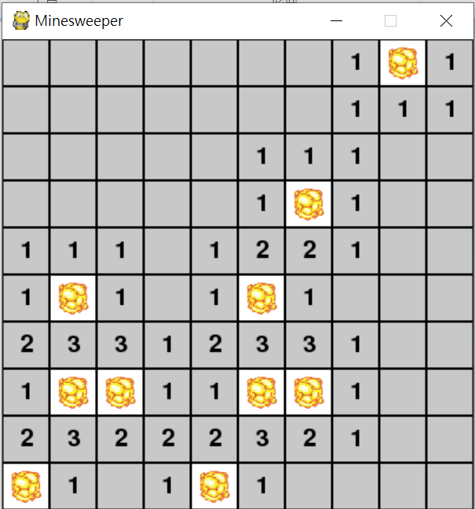
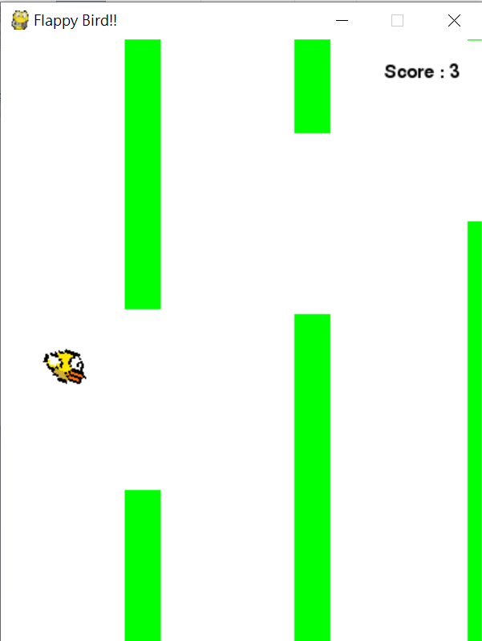
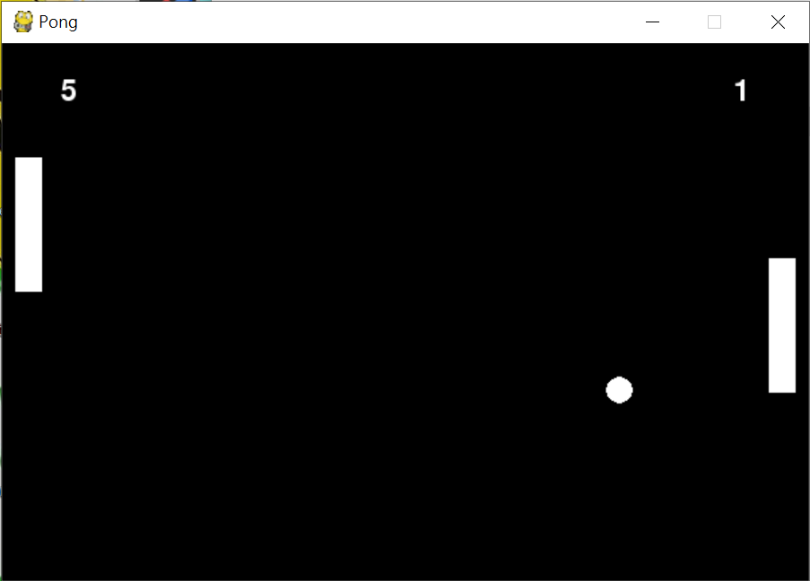

# Mini Games with Pygame

This projects implement several classic and popular games in Python, using python package -- `pygame`.

Currently, 4 games are already made in this project, listing below:

* [2048](https://github.com/MaxHsu88/Mini-Games-with-Pygame/tree/master/2048)
* [Flappy Bird](https://github.com/MaxHsu88/Mini-Games-with-Pygame/tree/master/FlappyBird)
* [Minesweeper](https://github.com/MaxHsu88/Mini-Games-with-Pygame/tree/master/Minesweeper)
* [Pong](https://github.com/MaxHsu88/Mini-Games-with-Pygame/tree/master/Pong)

## Game scene

<figure class="half">
    
    
</figure>

<figure class="half">
    
    
</figure>

## How to run this project ?

### Install pygame

Open your terminal console and enter `pip install pygame` to finish install.

## Acknowledgments

* [Snakegame Tutorial (pygame)](https://www.youtube.com/watch?v=V_f07t570pA) - You can start with this tutorial to get
an brief notion on how pygame actually works.
* [Pygame Website](https://www.pygame.org/tags/all) - After knowing how it works, you can go to this website to see others' projects
or even make your own projects.
